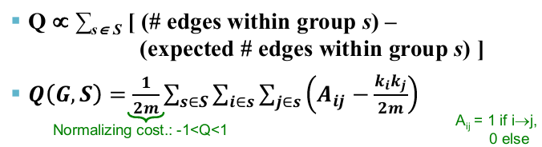

# GN算法实现
## 实验环境
- Windows 10 企业版
- Python 3.7.4
- 第三方包
  1. [NetworkX](https://networkx.github.io/) 用来解析数据得到图 
  2. [Matplotlib](https://matplotlib.org/) NetworkX用来画图的 
  3. [Graphviz](https://graphviz.readthedocs.io/en/stable/) 另一个画图，效果好一点 
## 算法简介
&emsp;&emsp;GN算法，即Girvan-Newman 社区划分算法，它属于分裂的层次聚类算法，基本思想是不断删除网络中“介值”最大的边，直到所有边都被删除。目标函数值取得最大值的时候，以当前图的连通分量为社区进行划分。 
- 介值：一条边在最短路径中出现的次数 
为了计算这个值，我先得出了图中所有节点之间的最短路径，再遍历每一条路径为每条边计统计介值 
- 目标函数（模块度）： 
 
对于任意两点i和j，ki、kj表示结点的度，m是边的数量，Ai,j表示两个点之间的连通性
## 运行说明
Python是解释性语言，每次运行前不需要编译，所以直接把文件名写进了代码里，如果要切换不同的样例，需要在代码里改一下
1. python main.py 
运行算法的主要部分
2. python draw_nx.py 
绘制算法结果，会弹窗显示社区分组的图
## 文件说明
### 代码
1. main.py 
算法实现的主要部分
2. file_io.py 
负责文件的读取和写入
3. draw_nx.py 
负责把结果画出来，用的是NetworkX内的画图API
4. gml.py 
把结果文件导出成gml格式
5.draw_graphviz.py 
用graphviz画的图，效果比直接用NetworkX好一点
### 数据集
Data文件夹按照每个数据集一个文件夹，每个文件夹的文件如下： 
- nodes.csv 图上的节点（经过处理）
- edge.csv 图上的边的集合（经过处理）
- result.txt 算法结果，每行一个社区
- recode.txt 算法运行过程中目标函数值的记录
- graph.gml 图的GML文件，导出这个本来要在Netdraw里面画图的，但是找了半天没找到怎么导入自己的社区
- graph.gv 用graphviz画图过程中导出的文件
- graph.gv.png 用graphviz画的图
### 数据集来源
- simple 
就是上课的时候的那个简单的样例，用来DEBUG
- karate 
Zachary 网络是通过对一个美国大学空手道俱乐部进行观测而构建出的一个社会网络。网络包含 34 个节点和 78 条边，其中个体表示俱乐部中的成员，而边表示成员之间存在的友谊关系。[源地址](http://www-personal.umich.edu/~mejn/netdata/karate.zip)
- football 
College Football 网络 Newman 根据美国大学生足球联赛而创建的一个复杂的社会网络。该网络包含 115个节点和 616 条边,其中网络中的结点代表足球队，两个结点之间的边表示两只球队之间进行过一场比赛。参赛的115支大学生代表队被分为12个联盟。比赛的流程是联盟内部的球队先进行小组赛,然后再是联盟之间球队的比赛。这表明联盟内部的球队之间进行的比赛次数多于联盟之间的球队之间进行的比赛的次数。联盟即可表示为该网络的真实社区结构。[源地址](http://www-personal.umich.edu/~mejn/netdata/football.zip)
- dolphins 
Dolphin 数据集是 D.Lusseau 等人使用长达7年的时间观察新西兰Doubtful Sound海峡62只海豚群体的交流情况而得到的海豚社会关系网络。这个网络具有62个节点，159条边。节点表示海豚，而边表示海豚间的频繁接触。[源地址](http://www-personal.umich.edu/~mejn/netdata/dolphins.zip) 
*PS: 数据集下载下来格式不完全一致，针对每个数据集都做了预处理，但这部分代码只用一次，所以没上传。另外还找了更大的数据集，但是电脑内存不够，没跑出来。*
## 运行结果样例
统一社区采用相同颜色，图上的样例是上课的时候的样例  

